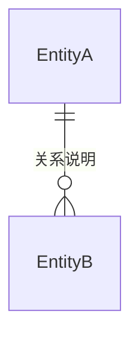
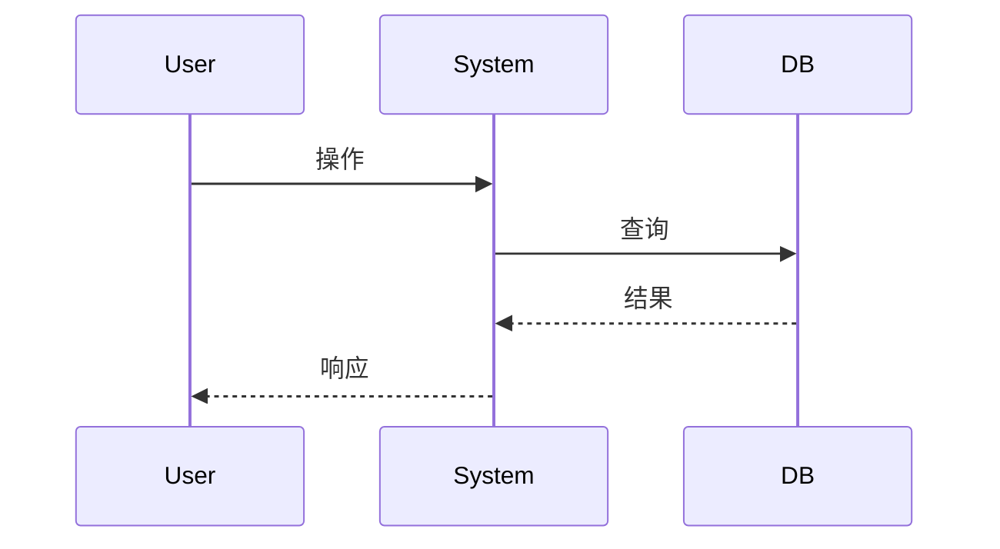

# 设计文档创建器 (Design Doc Creator)

## 用途

创建结构化的产品设计或技术设计文档，存入 `f:\独立开发者\项目\生活助手智能体\doc\design` 目录。

## 调用时机

- 用户要求编写设计方案/设计文档
- 用户要求编写架构设计
- 用户要求编写产品设计
- 用户要求对某个想法出具正式的设计方案
- 用户说"创建design doc"/"创建设计方案"/"生成设计文档"

## 与 solution / execution 的边界

| 维度 | design-doc-creator（本） | solution-doc-creator | execution-doc-creator |
|------|------------------------|---------------------|----------------------|
| 阶段 | 早期设计：思想/概念/方案探索 | 方案设计：总体思路/取舍/边界 | 代码执行：改哪些文件、怎么改 |
| 是否碰代码 | 否 | 否 | 是 |
| 回答 | 做什么、为什么 | 怎么做（方案层面） | 改哪里、改成什么样 |
| 存放路径 | `doc/design/` | `doc/solution/` | `doc/execution/` |

## 目录结构规范

所有设计文档统一存储在以下路径：

```
f:\独立开发者\项目\生活助手智能体\doc\design\<YYYY>\<MM>\<文档名称>.md
```

其中：
- `<YYYY>`：当前年份（4 位数字）
- `<MM>`：当前月份（2 位数字，补零）
- `<文档名称>`：中文描述，清晰反映文档主题

例如：
- `f:\独立开发者\项目\生活助手智能体\doc\design\2026\06\动态上下文系统设计.md`
- `f:\独立开发者\项目\生活助手智能体\doc\design\2026\06\尽调轮次隔离方案.md`

---

## 文档编写模板

每份设计文档应包含以下章节，根据实际需求可选增减：

```markdown
# <文档标题>

## 1. 背景与问题

### 1.1 现状描述
当前系统的运作方式、数据流转、关键约束。

### 1.2 问题陈述
当前方案存在的痛点或局限，为什么需要新的设计。

---

## 2. 核心概念与目标

### 2.1 核心概念定义
引入的关键概念及其定义（如"动态上下文""分析轮次"）。

### 2.2 设计目标
明确本次设计要达成的目标（用可验证的表述）。

### 2.3 非目标
明确本次设计不做什么（防止范围蔓延）。

---

## 3. 方案设计

### 3.1 核心思路
一句话概括方案的核心思路。

### 3.2 数据模型
新增或修改的数据实体及其关系。可用 Mermaid ER 图：



### 3.3 关键流程
核心交互流程，可用 Mermaid 时序图：



### 3.4 决策权衡
关键设计决策的理由、替代方案及取舍原因。

---

## 4. 涉及范围

### 4.1 涉及的端与角色

| 端 | 是否涉及 | 说明 |
|:---|:---|:---|
| xxx | 是/否 | ... |

### 4.2 涉及的概念与数据模型
列出本设计涉及的核心概念、数据实体及其关系（不列具体文件路径与改动——那是 execution-doc-creator 的职责）。

---

## 5. 边界与约束

### 5.1 已知限制
当前方案的已知局限或未覆盖的场景。

### 5.2 向后兼容
是否影响现有数据/接口，迁移策略。

---

## 6. 待解决问题

列出当前方案尚未最终确定的问题，供后续迭代决策。

---

## 7. 演进路线（可选）

> 仅描述设计演进方向，不含具体文件改动与实施顺序（归 execution 文档）。

| 阶段 | 内容 | 依赖 |
|------|------|------|
| 阶段一 | xxx | - |
| 阶段二 | xxx | 阶段一 |
```

---

## 编写原则

1. **概念先行**：先定义清楚核心概念，再展开设计
2. **决策有理由**：每个关键设计决策说明"为什么这样做"和"为什么不那样做"
3. **图表辅助**：复杂关系用 Mermaid 图表表达，降低理解成本
4. **多端覆盖**：功能涉及多端时，设计必须覆盖各端和角色差异
5. **诚实对待不确定性**：尚未想清楚的问题放在"待解决问题"章节，不假装已解决
6. **简洁务实**：避免过度设计，只设计当前需要的东西，不预测未来的需求

## 文档状态生命周期（文件名前缀 = 文档级状态）

文件名前缀随文档进度推进，便于扫目录一眼看出进度、中断后定位续做：

| 阶段 | 文件名前缀 | 何时 |
|---|---|---|
| 未处理 | `未处理-<主题>.md` | 文档刚创建，尚未开始 |
| 处理中 | `处理中-<主题>.md` | 开始处理/编写时重命名 |
| 已完成 | `已完成-<主题>.md` | 全部完成时重命名 |

状态迁移规则：
- 开始处理 → 文件名前缀改 `处理中-`
- 全部完成 → 文件名前缀改 `已完成-`
- 中断续做：重新打开文档，从上次进度继续，已完成内容不重做

> 改名仅人工约定，**无任何脚本/流程依赖文件名**，可放心改名（各文档生成 skill 统一约定）。

## 输出要求

- 文档语言与用户提问语言保持一致
- 文档名称格式：`未处理-<主题>.md`，主题使用中文，简洁明了；开始处理改 `处理中-`，全部完成改 `已完成-`（见「文档状态生命周期」）
- 必须先创建目录 `doc/design/<YYYY>/<MM>/`（如不存在）
- 创建完成后告知用户文档存放路径
