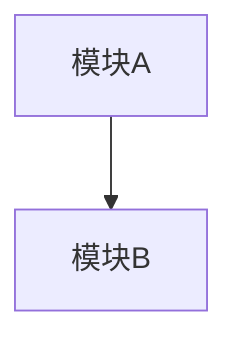

# 技术方案文档创建器 (Solution Doc Creator)

## 核心概念

在 `doc/solution/<YYYY>/<MM>/` 创建**纯技术方案设计**文档，回答"怎么做（方案层面）"，**不含具体代码修改**（文件改动/字段 Schema/接口签名/实施计划均归 execution-doc-creator）。

**目录**: `doc/solution/<YYYY>/<MM>/`

## 与 design / execution 的边界

| 维度 | design-doc-creator | solution-doc-creator（本） | execution-doc-creator |
|------|--------------------|---------------------------|----------------------|
| 阶段 | 早期设计：思想/概念探索 | 方案设计：总体思路/取舍/边界 | 代码执行：改哪些文件、怎么改 |
| 是否碰代码 | 否 | 否 | 是 |
| 回答 | 做什么、为什么 | 怎么做（方案层面） | 改哪里、改成什么样 |
| 存放路径 | `doc/design/` | `doc/solution/` | `doc/execution/` |

## 调用时机

- 用户要求编写技术方案/设计方案/需求文档
- 有早期设计想法，需要落成正式方案（但还不到改代码）
- 用户说"写方案/设计一下/出个方案"

## 文档模板

```markdown
# <文档标题>

## 1. 背景与目标

### 1.1 现状分析
### 1.2 设计依据
### 1.3 目标（可量化表述）

## 2. 总体方案



## 3. 方案设计

### 3.1 核心思路
一句话概括方案核心。

### 3.2 数据模型（概念层面）
数据实体及关系，可用 Mermaid ER 图（不写具体字段 Schema 代码）。

### 3.3 关键流程
核心交互流程，可用 Mermaid 时序图。

### 3.4 决策权衡
关键决策的理由、替代方案及取舍（每个决策一句话理由 + 对比表）。

## 4. 边界与约束

### 4.1 已知限制
### 4.2 向后兼容（原则层面，不写具体迁移代码）

## 5. 风险评估

| 风险 | 等级 | 缓解方向 |
|------|------|---------|

## 6. 待解决问题

未决问题，供后续决策。
```

## 编写原则

| 原则 | 要求 |
|------|------|
| 纯方案设计 | 只写思路、取舍、边界，不写文件改动/字段代码/接口签名 |
| 决策有理由 | 每个关键决策给"为什么"+"替代方案"，用对比表 |
| 多端覆盖 | 考虑 server / miniapp / web-saas 三端差异 |
| 量化指标 | 目标用具体指标代替"提升体验" |
| 设计依据可追溯 | 引用对应 design 文档路径 |

## 禁止事项

❌ 写迁移/新增/修改/删除清单（归 execution-doc-creator）
❌ 写具体字段 Schema 代码或接口签名（归 execution-doc-creator）
❌ 写实施计划/阶段依赖（归 execution-doc-creator）
❌ 文档名称使用英文或非描述性命名
❌ 使用模糊描述代替量化指标

## 文档状态生命周期（文件名前缀 = 文档级状态）

文件名前缀随文档进度推进，便于扫目录一眼看出进度、中断后定位续做：

| 阶段 | 文件名前缀 | 何时 |
|---|---|---|
| 未处理 | `未处理-<主题>.md` | 文档刚创建，尚未开始 |
| 处理中 | `处理中-<主题>.md` | 开始处理/编写时重命名 |
| 已完成 | `已完成-<主题>.md` | 全部完成时重命名 |

状态迁移规则：
- 开始处理 → 文件名前缀改 `处理中-`
- 全部完成 → 文件名前缀改 `已完成-`
- 中断续做：重新打开文档，从上次进度继续，已完成内容不重做

> 改名仅人工约定，**无任何脚本/流程依赖文件名**，可放心改名（各文档生成 skill 统一约定）。

## 注意事项

1. 文档语言与用户提问语言保持一致
2. 文件名格式：`未处理-<主题>.md`，主题用中文；开始处理改 `处理中-`，全部完成改 `已完成-`（见「文档状态生命周期」）
3. 必须先创建目录 `doc/solution/<YYYY>/<MM>/`（如不存在）
4. 方案定稿后，若要落地改代码，用 execution-doc-creator 生成执行文档
5. 创建完成后告知用户存放路径
