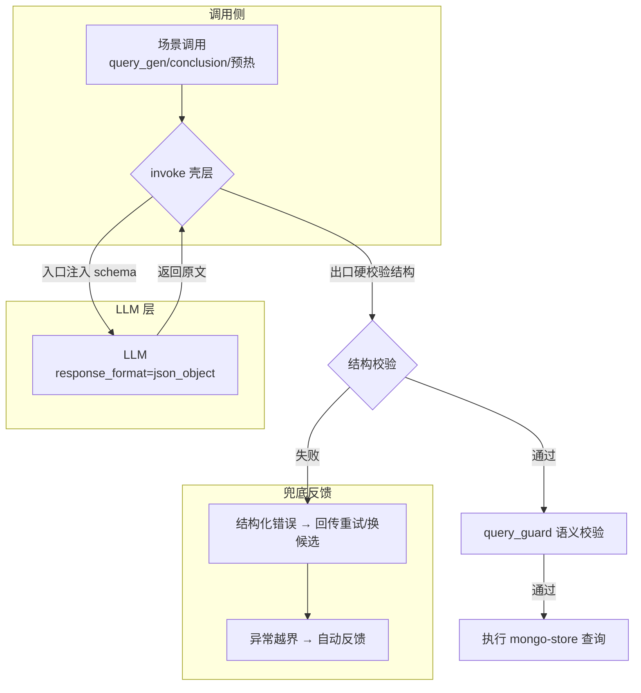
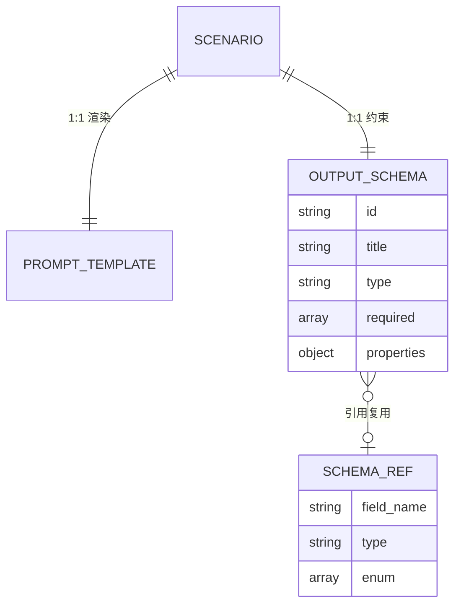
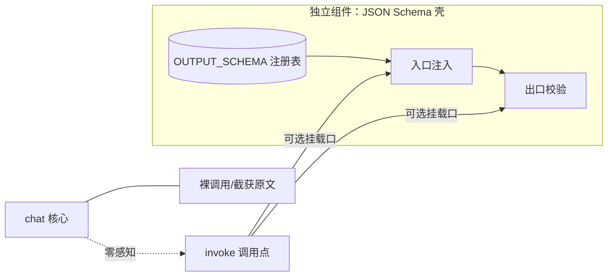
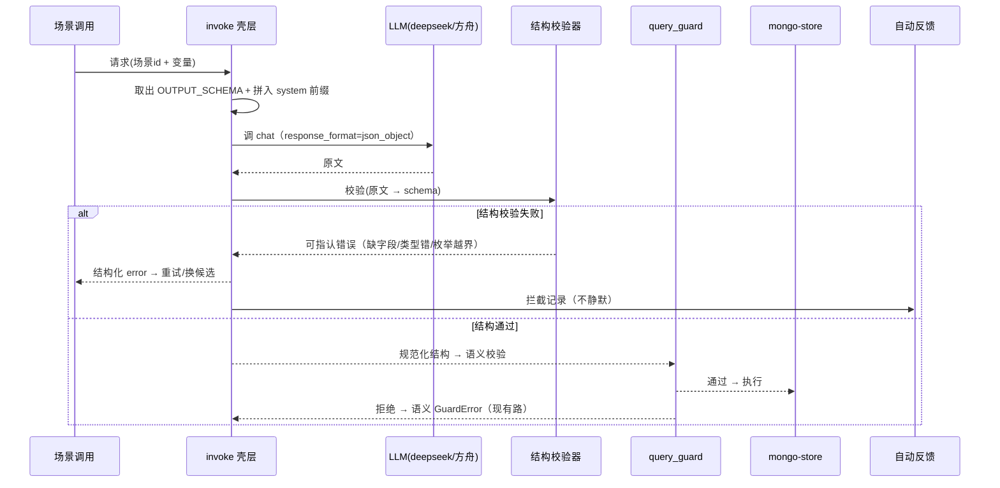

# LLM 外置 JSON Schema 壳：结构提升 + 出口硬校验

## 1. 背景与目标

### 1.1 现状分析

| 环节 | 现状 | 缺口 |
|------|------|------|
| 调用 | `llm_client.invoke()` 唯一出口，`response_format` 未启用 | 只靠 prompt 求模型守格式 |
| 解析 | `extract_json()` 仅剥 ```fw围栏 + `json.loads` | **结构对但缺字段/类型错/枚举越界都能通过**，仅"整体非 JSON"才抛错 |
| 约束 | `query_gen` 用 system **散文**规定输出格式 | 是自然语言，非机器可校验 schema |
| 语义守卫 | `query_guard` 对照业务 schema 做白名单校验 | 只处理"进得来"的查询，管不到"长得不对"的中间产物 |

结论：出口目前**只守住了"是不是 JSON"**，没有守住"JSON 长什么样"。目标的向下限由 `query_guard` 兜住，但上游已累计了可避免的解析噪音与重试浪费。

### 1.2 设计依据

- 《经管之星AI问数助手需求文档》：text-to-query 为唯一数据问答链路。
- 《问数查询链路优化-方案》：多候选并发生成择优 + 缓存热度分级 + **system 前缀共享缓存**。本方案必须保持前缀恒定、不破坏前缀 cache。
- 项目基调：数据可信是底线、防护是前哨、允许被拦禁止静默（自动反馈）。

### 1.3 目标（可量化）

1. 非法结构 JSON（缺字段/类型错/枚举越界）在到达 `query_guard` 前被拦截，拦截信息可指认为"哪一字段/哪一类型"。
2. query_gen 一轮通过率（首过守卫）不因壳的注入下降（目标维持现状水平），并有望因机器约束小幅提升。
3. 壳的 schema 注入保持 system 前缀完全恒定，`prompt_cache_hit_tokens` 不受影响（前缀 cache 不失效）。
4. 壳对所有响应式场景通用、平台无关（deepseek 不支持 json_schema 也能生效），无单平台特判。

## 2. 总体方案

核心 = 在 `llm_client.invoke()`（唯一出口）外挂一层**场景化 JSON Schema 壳**，形成两层校验：

- **壳（结构前置）**：入口按场景把 schema 固化进 system 前缀，出口按同 schema 硬校验。管"长得对不对"。
- **query_guard（语义权威）**：白名单模型/字段/操作符/聚合/limit。管"用得对不对"。



## 3. 方案设计

### 3.1 核心思路

一句话：**把"求模型自觉守格式"改为"入口喂 constraint、出口验 constraint"**——注入与校验用同一份 schema（单一事实来源），失败信息精确指认，供重试自纠。

### 3.2 数据模型（概念层面）

按场景注册的 schema 资产，与现有 prompt 注册表并存，构成"场景 → (消息渲染 + 输出 schema)"的一对一映射。



- SCENARIO：现有场景 id（query_gen / conclusion / 预热等），唯一身份。
- OUTPUT_SCHEMA：该场景产出 JSON 的结构声明（必填键 / 类型 / 枚举 / 嵌套），只做结构约束，**不做业务语义约束**（语义归 query_guard）。
- SCHEMA_REF：跨场景复用的基础类型定义（如"度量范围""字段枚举"），避免重复。
- SCENARIO_ID：壳的挂载凭证——invoke 靠它检索对应 OUTPUT_SCHEMA。

### 3.3 解耦边界（挂载，非嵌入）

壳与 LLM 客户端是**注册式挂载**关系，不是织入关系：



- **壳 = 独立模块**：schema 拾取、注入、出口校验、错误构建，全部收敛在壳内，不散落在各场景。
- **invoke = 浅层挂载点**：仅提供一个可选挂载口（有 schema 则挂，无则直通现状），不承载任何场景 schema 知识。
- **chat() = 零感知核心**：不做任何适配、不看 schema，保持纯粹；壳只在调用点做"改 system 前缀 + 对返回原文校验"，不侵入内部循环。
- 好处：任何场景要上壳，只需注册一条 OUTPUT_SCHEMA + 在 invoke 挂载口声明即可；LLM 平台层、缓存、响应解析全部不动。

### 3.4 关键流程



### 3.5 决策权衡

| 决策 | 选择 | 理由 | 替代方案 | 取舍结论 |
|------|------|------|----------|----------|
| 注入方式 | prompt 注入 schema + `response_format=json_object` | deepseek 原生不支持 json_schema；`type:json` 平台无关、向后兼容多平台 | 仅依赖平台原生 json_schema / function calling | 通用优先，平台特判不值得做 |
| 壳的位置 | 独立组件**挂载**于 `invoke()`，仅浅层嵌入调用点，`chat()` 核心零感知 | 解耦：壳自成模块（schema 拾取/注入/校验全在壳内），invoke 只留一个可选挂载口，不把场景 schema 逻辑织入通用 LLM 客户端 | 壳逻辑深嵌 invoke / 各场景各自散落校验 | 挂载优先，只做浅层嵌入 |
| 校验时机 | 出口硬校验（同步、失败即挡） | "允许被拦禁止静默"，错误即时回传 | 仅 log 不阻断 | 必须阻断，配合重试 |
| schema 与语义分层 | 壳只做结构，语义全归 query_guard | 结构验证不了"字段在该模型存在"等业务事实 | 壳里并入业务白名单 | 各管一段，纵深防御 |
| schema 放 system 前缀 | 恒定前缀，不进 user 消息 | 保持前缀 cache 有效，成本不涨 | 每条消息动态拼 schema | 恒定前缀优先 |
| 校验器选型 | 按需抉择（轻量自写 vs jsonschema 库） | 高频单一场景轻量自写够用；多场景复用才值引库 | 引全量 jsonschema | 依场景数定，见"待解决问题" |
| 失败重试 | 复用现有 retries / 多候选择优 | 已有 `bad_query/error` 分支与候选管道 | 新造重试机制 | 最大化复用现状 |

## 4. 边界与约束

### 4.1 已知限制

- 壳只保证**结构合法**，不保证**语义正确**（字段真实性、算子白名单、limit 上限）——语义权威仍是 query_guard。
- `type:json` 模式下多数供应商要求在 prompt 中出现 "json" 字样（现状已满足），且**不保证 key 顺序/多余字段剔除**，多余字段仍需结构校验器处理。
- 壳不改变 LLM 网络调用形态（仍 httpx chat/completions），不改响应缓存逻辑。

### 4.2 向后兼容（原则层面）

- schema 为增量资产：新增场景注册 schema 即可，缺失 schema 的场景降级为现状（散文约束 + extract_json），不破坏已有链路。
- 结构校验失败走既有"拦截+反馈"路径，不新增对外错误语义，前端展示不变。
- 多候选管道（query_candidate）与热度分级（QA_TIER）不受影响：壳在校验层收敛，候选抽取逻辑不变。

## 5. 风险评估

| 风险 | 等级 | 缓解方向 |
|------|------|----------|
| schema 过严导致高拦截、重试变多 → 成本上升 | 中 | schema 只做结构不做语义；required 精确到必要字段；拦截率纳入量化跟踪 |
| 恒定量保证破坏前缀 cache | 中 | schema 严格走 system 前缀常量；schema 变更需评估缓存重建成本 |
| 校验器抛错信息不可读，模型无法自纠 | 中 | 错误按"缺字段/类型/枚举"分类给出模板化信息，喂回重试 prompt |
| 引 jsonschema 库增加体积/复杂 | 低 | 轻量自写优先，仅多场景复用才引库 |
| 平台对多余字段不剔除 → 污染规范化 | 低 | 结构校验后按 schema 白名单过滤多余键，输出收敛字段 |

## 6. 待解决问题

1. 校验器选型：先评估当前场景数（query_gen / conclusion / 预热是否都需要正式 schema），单场景建议轻量自写，多场景复用再引 jsonschema 库。
2. conclusion 场景是否需要 schema：其为自由文本 + 结构混合（表格/统计/图表），能否拆出可校验的结构段仍需评估。
3. schema 与 `SYSTEM_TMPL` 现有散文的关系：机器 schema 与散文说明并存，还是逐步以 schema 替代散文，需定颗粒度。
4. 拦截量化指标口径：以"结构校验失败即重试、不再触发 query_guard"为准，需要一个轻量打点确认壳生效与拦截率。