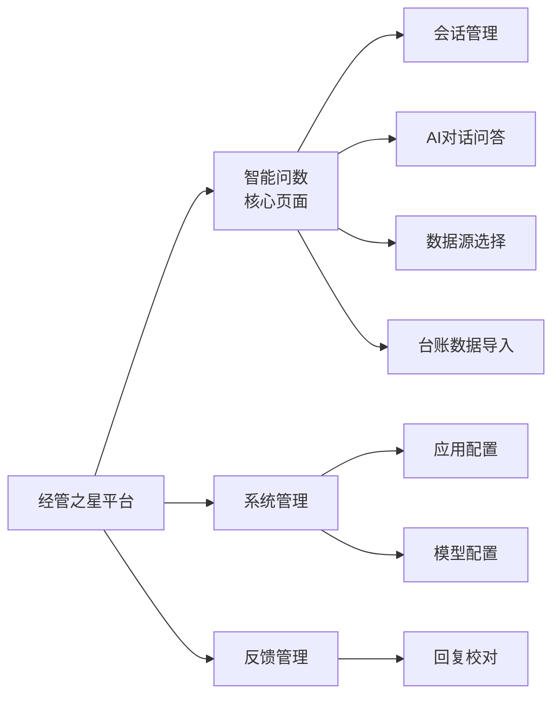
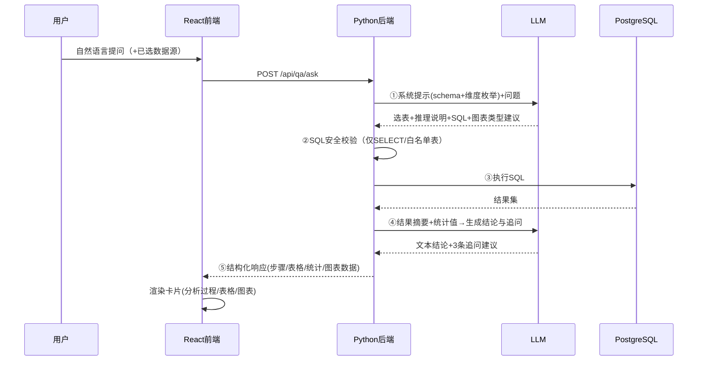
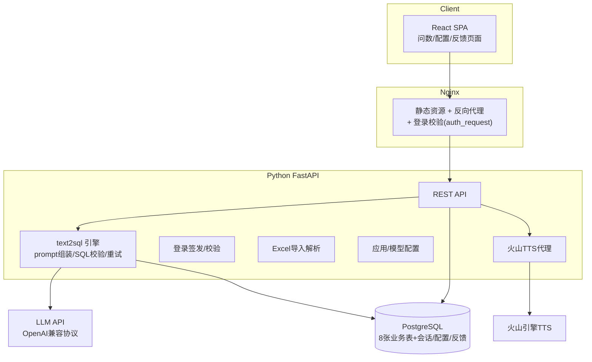
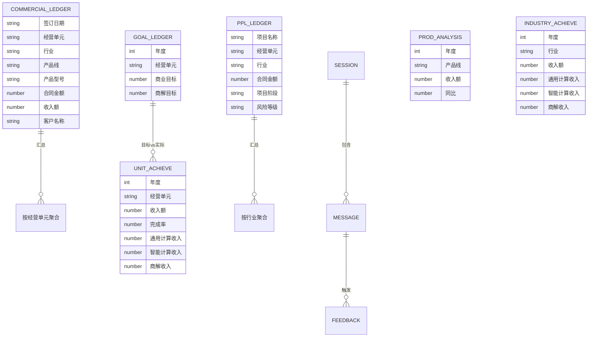

# 经管之星·AI问数助手 需求文档

> 版本：v1.0 ｜ 日期：2026-09-03 ｜ 依据：`doc/original/demo.html` 原型 + 二面任务书
> 性质：应用开发实战需求文档（含总体技术方案），供后续设计/执行文档引用

***

## 1. 背景与目标

### 1.1 现状分析

原型 `demo.html`（160 万字节日行 HTML）实现了"经管之星——企业级销售经管数据管理平台"的纯前端演示，核心是 **AI 智能问数**：用户用自然语言提问，AI 自动选择数据源、生成 SQL、执行取数，并以"分析过程 + 数据发现 + 表格 + 统计 + 可视化图表 + 追问建议"的结构化卡片回答。原型所有数据均为前端 mock，AI 回复为固定模板。

### 1.2 任务要求（来自任务书）

| 项           | 要求                                                                                                                                               |
| ----------- | ------------------------------------------------------------------------------------------------------------------------------------------------ |
| 前端          | React                                                                                                                                            |
| 后端          | Python                                                                                                                                           |
| 其余技术栈       | 不限（模型不限、工具不限）                                                                                                                                    |
| text2sql 数据 | **自制**（不接真实业务库）                                                                                                                                  |
| 登录/用户管理     | **不做**业务级登录与用户管理；但需 **nginx 简单登录校验**：固定账号密码、**24 小时时效**                                                                                          |
| 语音          | 可选：语音转文字、文字转语音（火山 TTS，应用 `api-key-20260421205439`，KEY `288797e3-1e13-4dd8-a823-27d31e707551`，文档 `https://docs.volcengine.com/docs/6561/2532486`） |
| 验收          | ① 功能演示 ② 代码 review                                                                                                                               |
| 考察点         | **功能完善度 + 代码评审情况**                                                                                                                               |

### 1.3 目标（可量化）

1. 端到端复刻原型 4 个页面的全部可见功能：智能问数、应用配置、模型配置、回复校对
2. AI 问数链路**真实化**：mock 回复 → LLM 驱动的 text2sql（选表 → 生成 SQL → 执行 → 图表/结论），分析过程 5 步展示真实中间产物
3. 自制 8 张业务数据表（3 台账 + 5 统计报表），数据量与维度值取自原型（21 个经营单元、14 个行业、3 条产品线、2025/2026 两个年度）
4. 支持 4 类图表（柱状/条形/饼图/折线），图表类型由用户提问指定或 AI 自动选择
5. 未登录访问任意页面 → nginx 拦截跳登录页；登录后 24 小时内免重复登录

***

## 2. 原型功能模块总览

原型侧边栏共 4 个页面（另有驾驶舱/报表代码残留但无导航入口，见 §8 边界）：

***

## 3. 功能需求详述

优先级定义：P0 = 演示必备核心；P1 = 完善度加分项，应实现；P2 = 可选项/增强。

### 3.1 智能问数（核心，P0）

#### 3.1.1 会话管理侧栏（P0）

- 侧栏标题"近30天记录"，可收起/展开

- "开启新对话"按钮：新建空会话（标题"新对话"），进入欢迎页

- 会话列表：按时间倒序，**置顶会话排最前**（图钉图标）

- 会话自动命名：新会话第一条用户消息前 20 字（超出加 `...`）

- 会话条目右键/省略号菜单：**置顶/取消置顶**、重命名、删除（原型明确有置顶，重命名/删除一并实现）

- 会话点击：切换并完整恢复历史消息

- 持久化：会话数据存后端（登录用户维度），刷新/重开不丢失（原型用 localStorage，实作改为后端存储）

#### 3.1.2 欢迎页（P0）

- 标题："你好 / 我是经管之星·AI问数助手"，副文案："欢迎使用智能AI问数，您可以向我咨询经营数据、报表分析相关问题。"（文案可在应用配置中修改，见 §3.2）

- "你可以这么问我"快捷问题网格：内容 = 应用配置"对话开场白"里的开场问题列表（默认 3 条，对齐原型 appConfig：各产品线销售情况 / 北京的产品线收入情况 / 深圳的产品销售情况；可增删，上限 10 条，两列排布）：

  - 各产品线销售情况

  - 北京的产品线收入情况

  - 深圳的产品销售情况

  > 注：原型 `_QQ_DATA.recommend` 中另有 6 条问法（2026年各经营单元收入排名等）未被任何渲染逻辑使用，属残留数据，不作为欢迎页默认内容。

- 点击快捷问题 → 直接发送并进入对话

#### 3.1.3 聊天消息（P0）

**用户消息气泡**，下方 4 个操作按钮：

| 操作     | 行为                                         |
| ------ | ------------------------------------------ |
| 收藏（星标） | 收藏/取消收藏该问题，金色高亮；收进快捷提问"收藏"Tab              |
| 编辑     | 气泡变文本域，出现"取消 / 重新发送"按钮；重发后替换原问题并重新生成 AI 回复 |
| 重新发送   | 原样再问一次，生成新 AI 回复                           |
| 复制     | 复制问题文本                                     |

**AI 回复卡片**（结构化，自上而下）：

1. **分析过程条**（可折叠，默认收起）——真实执行轨迹，5 步：

   - ① 选择数据表 & 数据时效：本次选用的数据源、数据截止日期、业务口径

   - ② 推理逻辑：问题拆解、筛选条件、指标换算

   - ③ 执行取数 SQL：真实生成的 SQL（代码样式展示）

   - ④ 展示取数结果：指标数值摘要、图表类型说明

   - ⑤ 执行结束：全部完成声明 + 总耗时
2. **模块1 数据发现**：数据范围要点列表（涉及维度、时间、口径）
3. **模块2 数据表格**：查询结果表格（列头 + 数据行，超长横向滚动）
4. **模块3 数据统计**：总记录数、平均值、最大值（含归属）、最小值（含归属）
5. **模块4 数据可视化**：按用户指定或 AI 自动选择的图表类型渲染（柱状/条形/饼图/折线），带图例与单位说明
6. **页脚**：

   - 操作按钮：复制（整卡内容）、反馈（不满意，提交回复校对）、语音播放（TTS，见 §3.6）

   - 统计信息：耗时（如 0.6s）、Token 消耗、时间戳
7. **追问建议**：3 条相关问题 chips，点击即发送（受"下一步问题建议"开关控制，见 §3.2）

**AI 生成失败**：显示友好错误提示（如"未能生成有效查询，请换种问法"），不裸抛异常。

#### 3.1.4 输入栏（P0）

- 输入框：Enter 发送、Shift+Enter 换行；空内容不发送

- 快捷提问按钮（闪电图标）：弹出面板，两个 Tab——**常问**（按提问频次统计，受"常问设置"开关控制）/ **收藏**（用户收藏的问题，可移除）；点击条目直接发送

- 麦克风按钮：语音转文字输入（P2 可选，见 §3.6）

- 发送按钮：发送当前输入

- 数据源选择按钮：显示"已选 N 个数据源 / 已选择所有数据源"，打开数据源选择弹窗（见 3.1.5）

#### 3.1.5 数据源选择（P0）

弹窗按组分类多选（原型 8 项，默认全选）：

| 组    | 数据源     | 说明            |
| ---- | ------- | ------------- |
| 台账数据 | 商业市场台账  | 明细级签约/收入数据    |
| 台账数据 | PPL明细台账 | 项目明细（含风险等级）   |
| 台账数据 | 整体目标台账  | 年度经营目标        |
| 统计报表 | 整体达成    | 中国区整体及各经营单元达成 |
| 统计报表 | 产品分析    | 产品线分析         |
| 统计报表 | 商解专项    | 商解专项分析        |
| 统计报表 | 行业达成    | 行业达成分析        |
| 统计报表 | 重点单元    | 重点单元分析        |

- 所选数据源集合作为 text2sql 的候选 schema 范围（选越多，表选择难度越大；支持全选/全不选）

- 选择持久化（跨会话记忆）

#### 3.1.6 text2sql 引擎（P0，后端核心）

问数链路：

要求：

1. **Schema 注入**：将所选数据源的建表语句/字段注释/维度枚举值注入系统提示，保证枚举类筛选（经营单元名、行业名）生成正确
2. **SQL 约束**：仅允许单条 SELECT；禁止 DML/DDL/多语句；表名必须在所选数据源白名单内；执行超时控制（如 10s）
3. **失败重试**：SQL 执行报错时，将错误信息回传 LLM 自我修正，最多重试 2 次；仍失败则返回友好错误
4. **结果处理**：行数上限（如 200 行进表格，超出提示总数）；数值列自动计算统计（记录数/均值/最大/最小）
5. **图表指令**：用户指定图表类型优先；未指定时由 LLM 按数据形态选择（对比→柱状、占比→饼图、趋势→折线）
6. **成本展示**：记录本次请求耗时与 Token 用量回传前端

#### 3.1.7 典型问答场景（验收演示脚本）

自制的 text2sql 数据须支撑以下原型示例问题全部正确回答：

| # | 问题                                              | 期望                |
| - | ----------------------------------------------- | ----------------- |
| 1 | 2026年各经营单元的收入和完成率分别是多少？用柱状图展示一下                 | 经营单元×收入/完成率表格+柱状图 |
| 2 | 帮我筛选政企行业收入3000万-5000万的数据，按收入从高到低排序，用饼图展示各经营单元占比 | 区间筛选+排序+饼图        |
| 3 | 2026年销售最多的3个产品型号是什么？用条形图展示销售额和占比                | TOP3+条形图          |
| 4 | 2026年各产品线的同比变化情况？用折线图展示                         | 产品线×同比+折线图        |
| 5 | 2026年每月的合同金额趋势是怎样的？用折线图展示                       | 月度聚合+折线图          |
| 6 | 目前有多少高风险项目？                                     | 单值/简答             |
| 7 | 北京代表处今年达成情况                                     | 多指标简答+表格          |

### 3.2 系统管理 → 应用配置（P1）

6 张配置卡片，每张含开关，部分含配置弹窗：

| 卡片      | 默认 | 配置弹窗内容                  |
| ------- | -- | ----------------------- |
| 对话开场白   | 开  | 开场白文案（textarea）+ 开场问题列表（增删，≤10 条）；文案对应欢迎页副文案，标题"你好/我是经管之星·AI问数助手"固定 |
| 下一步问题建议 | 开  | 无（开关控制追问 chips 显隐）      |
| 文字转语音   | 关  | 无（开启后 AI 回复页脚"语音播放"可用）  |
| 语音转文字   | 关  | 无（开启后输入栏麦克风可用）          |
| 模型配置    | 开  | 点击跳转模型配置页               |
| 常问设置    | 开  | 问题频次阈值（同一问题出现次数 ≥ 阈值即视为常问，默认 3；对齐原型 hotConfigModal，而非配置列表） |

- 配置全局生效、后端持久化

- 管理端即时生效，无需重启

### 3.3 系统管理 → 模型配置（P1）

- "应用模型设置"：智能问数模型的 LLM 下拉选择 + 保存

- "新增模型"弹窗：仅 3 个必填项——API Base URL、API Key、模型 ID（OpenAI 兼容协议）；模型名称不手动填写，由后端自动生成（= 模型 ID，同名模型追加 host 前缀区分，对齐原型 mcAddModel）；弹窗带"测试连接"按钮（发一次最小请求验证连通，通过前"添加"按钮禁用，对齐原型 mcTestConnection），新增后进入可选列表

- 内置至少 1 个可用模型（如 DeepSeek）保证开箱可演示

- API Key 仅存后端，前端不暴露

### 3.4 反馈管理 → 回复校对（P1）

**用户侧（AI 回复卡片"反馈"按钮）**：

- 弹窗展示原问题 + AI 回复摘要，用户填写问题描述提交

- Toast："您的数据问题反馈已提交，我们将尽快核查，感谢反馈"

**管理侧（回复校对页）**：

- 筛选：按问题搜索、按用户搜索、状态筛选（全部/待处理/已处理）

- 列表字段（对齐原型列序）：序号、用户、问题、反馈时间、状态、操作

- 操作：查看详情弹窗（原问题+AI回复+用户描述），填写处理备注、标记"已处理"

- 分页（每页 5/10 条）

### 3.5 台账数据导入（P1）

- 入口：AI 问数页数据源弹窗内/顶部（原型为三类台账各自的"导入"+"导入记录"）

- 导入流程（年份选择器弹窗）：

  1. 选择年份（2025/2026）
  2. 填写数据统计截止日期（商业市场台账需要）
  3. 上传 `.xlsx/.xls` 文件
  4. 确认导入 → 校验（字段匹配、文件完整性）→ 成功/失败/部分成功

- 三类台账：商业市场台账、整体目标台账、PPL明细台账

- **覆盖语义**：整体目标台账导入后覆盖该年份全部数据（原型明示）

- **导入记录弹窗**：时间、导入操作人、年份、导入文件名、数据统计截止日期、导入结果（成功/失败-原因/部分成功）；**列按台账类型动态裁剪**（PPL 明细台账不显示"年份"列；整体目标台账不显示"数据统计截止日期"列，对齐原型 renderImportLog）；分页 5/10 条；按台账类型过滤

- 格式模板：提供下载模板（保证评审/演示时可复现导入）

- 导入后数据立即可被问数查询到

### 3.6 语音能力（P2，可选）

- **文字转语音（TTS）**：火山引擎 TTS 大模型语音合成 API；应用配置开启后，AI 回复页脚"语音播放"按钮可播报回复文本；流式播放、可停止

  - 凭据：应用 `api-key-20260421205439`，KEY `288797e3-1e13-4dd8-a823-27d31e707551`

  - Key 只存后端（环境变量/配置），前端经后端代理调用

- **语音转文字（STT）**：浏览器 Web Speech API 或火山 ASR，按住说话转文字填入输入框；实现成本高时可仅做 UI 占位并禁用

### 3.7 nginx 简单登录校验（P0，非业务登录）

- 固定账号密码（单组，配置在 nginx/后端配置文件中，如 `admin / <密码>`）

- 未认证访问任意路径 → 跳转/弹出简易登录页

- 认证通过后发放签名 Cookie，**有效期 24 小时**，期内免重复登录

- 过期后重新要求登录；登出按钮可主动失效

- 实现思路（二选一，见 §5.3 权衡）：nginx `auth_request` + Python 后端校验接口；或 nginx njs 签名 Cookie 校验

***

## 4. 总体技术方案

### 4.1 架构

### 4.2 技术选型

| 层        | 选型                                 | 理由                         |
| -------- | ---------------------------------- | -------------------------- |
| 前端       | React 19 + Vite + TypeScript       | 任务书要求 React；Vite 启动快       |
| UI 组件    | Ant Design 5                       | 表格/弹窗/表单成熟，与原型风格接近         |
| 图表       | ECharts (echarts-for-react)        | 柱/条/饼/折全覆盖，原型风格即 echarts 风 |
| 后端       | Python 3.11 + FastAPI              | 任务书要求 Python；异步+自动文档       |
| 数据库      | PostgreSQL                         | 标准关系型数据库，符合企业级演示习惯         |
| ORM/执行   | psycopg2-binary + 只读连接执行 AI 生成 SQL | 简单可控，便于 SQL 白名单校验          |
| Excel 解析 | openpyxl / pandas                  | 导入功能                       |
| LLM      | OpenAI 兼容协议（DeepSeek 等，模型配置页可切换）   | 模型不限，协议统一                  |
| 部署       | nginx + uvicorn（单机）                | 演示简单                       |

### 4.3 数据模型（概念层）

系统表（概念）：会话 SESSION、消息 MESSAGE（含 AI 回复结构化 JSON）、应用配置 APP\_CONFIG（KV）、模型 MODEL、反馈 FEEDBACK、导入记录 IMPORT\_LOG。

### 4.4 自制数据规范（text2sql 数据集）

**维度枚举（取自原型，保证演示一致性）：**

- 经营单元（21 个）：江西办事处、福建代表处、新疆代表处、安徽办事处、川藏代表处、陕西办事处、山西代表处、泛政府系统部、北京代表处、江苏代表处、辽宁办事处、浙江代表处、山东代表处、上海代表处、渠道部、湖北办事处、广州代表处、云南办事处、深圳代表处、内蒙古办事处、金融系统部

- 行业（14 个）：大企业、安平、金融、数字政府、互联网、智能制造、交通、医疗、通装、教育、油气矿山、电力、分销/ISV、JDJG（数据库可存"数字政府"等，问"政企行业"时由 prompt 映射到数字政府+泛政府相关口径）

- 产品线（3 条）：通用计算、智能计算、商业解决方案

- 产品型号：R5300 G5、R5500 G5、R5900 G5 等服务器型号系列

- 年度：2025、2026

**数量要求：**

- 商业市场台账 ≥ 400 行明细（原型 468 行，字段可从 97 列精简至 10\~15 核心列）

- PPL 明细台账 ≥ 100 行（含 7 个高风险项目，对应示例问题 6）

- 目标/达成/产品分析/行业达成/商解专项/重点单元：按维度组合生成（21 单元 × 2 年度 等）

- 数据间**逻辑自洽**：明细汇总值 ≈ 统计表值；完成率 = 收入/目标；占比合计 = 100%；同比 = (今年-去年)/去年

- 生成方式：Python 脚本 + 固定随机种子，可重复重建（脚本入库便于评审展示）

### 4.5 关键决策权衡

| 决策      | 选择                        | 替代方案                | 理由                                 |
| ------- | ------------------------- | ------------------- | ---------------------------------- |
| 数据库     | PostgreSQL                | MySQL / DuckDB（本地）  | 贴合企业级演示习惯，双方评委熟悉；DuckDB 可用于快速本地验证  |
| SQL 执行  | 后端校验后只读连接执行               | 前端直连 / 沙箱 DuckDB    | 安全校验集中后端；PG 连接串/凭据不入前端             |
| 会话存储    | 后端 PostgreSQL             | localStorage（原型做法）  | 跨设备/刷新稳定，反馈管理需关联消息                 |
| 登录校验    | auth\_request + 签名 Cookie | nginx auth\_basic   | 24h 时效需 Cookie 控制；auth\_basic 无法时效 |
| 图表      | ECharts                   | recharts/自绘 div（原型） | 4 类图全覆盖、交互成熟                       |
| AI 回复传输 | 一次性 JSON（首版）/ SSE 流式（增强）  | 纯一次性                | 演示"打字机+步骤渐进"效果更佳，若时间紧可先一次性         |

***

## 5. 边界与约束

### 5.1 明确不做（范围红线）

- **业务级登录/注册/用户管理/角色权限**（原型含账号权限模块，任务书明确不做）

- 移动端适配（桌面 Chromium 为目标）

- 真实企业数据对接（全部自制数据）

- 多租户、审计日志等生产级安全体系

- 原型中无导航入口的驾驶舱/报表页（RPT3/4/5、cockpit KPI）——其数据以"统计报表"数据源形式存在供问数，**页面本身不做**（如需可作 P2 增强）

### 5.2 已知限制

- LLM 生成 SQL 的准确率依赖 prompt 质量，枚举值须全量注入

- PostgreSQL 需独立数据库服务与连接配置（相对 SQLite 部署成本更高）；仅用于 AI 生成的只读校验执行，避免写权限暴露

- 火山 TTS 如网络不通，语音播放降级提示（不阻断主流程）

### 5.3 待确认问题

| # | 问题                 | 默认处理                                        |
| - | ------------------ | ------------------------------------------- |
| 1 | 登录固定账号密码具体值        | `admin / ***REMOVED***`（部署时配置文件可改）          |
| 2 | LLM 默认模型           | DeepSeek（需自备 API Key，模型配置页可换任意 OpenAI 兼容模型） |
| 3 | 追问建议由 LLM 生成还是规则拼接 | LLM 生成（更自然，成本可接受）                           |
| 4 | 语音转文字实现方式          | 时间允许用浏览器 Web Speech API，否则仅 UI 占位（任务书标注可选）  |

***

## 6. 非功能需求

| 项      | 指标                                                         |
| ------ | ---------------------------------------------------------- |
| 问数响应   | 常规问题端到端 ≤ 10s（含 LLM 两段调用）                                  |
| SQL 执行 | 单次 ≤ 2s，超时 10s 中止并走重试                                      |
| 图表渲染   | 数据到达后 ≤ 1s                                                 |
| 表格容量   | 单次最多展示 200 行，超出提示"共 N 条，已截断"                               |
| 安全     | AI 生成 SQL 仅 SELECT、表白名单、参数化无关（纯文本校验）；API Key/密码不入前端、不入 git |
| 登录时效   | Cookie 24h，过期自动跳登录                                         |
| 浏览器    | Chrome/Edge 现代版本                                           |

***

## 7. 验收标准（对应任务书验收方式）

### 7.1 功能演示脚本（端到端）

1. **登录**：未登录访问 → 登录页 → 固定账号进入；24h 内刷新免登录
2. **欢迎页**：开场白 + 快捷问题网格正常展示；点击问题直接提问
3. **核心问数**：依次演示 §3.1.7 七个原型示例问题——每次展示：分析过程 5 步（真实 SQL）→ 数据发现 → 表格 → 统计 → 图表（柱/饼/条/折）→ 追问 chips；点开一条追问继续问答
4. **消息操作**：收藏问题 → 快捷提问"收藏"Tab 出现；编辑重发；复制
5. **会话管理**：新对话、自动命名、置顶、切换恢复历史
6. **数据源**：只选"统计报表"组后问台账类问题 → AI 提示数据源不含所需表（或自动限定）；恢复全选
7. **导入**：下载模板 → 上传 xlsx（覆盖 2025 目标）→ 问"2025年目标"验证数据变化 → 查看导入记录
8. **应用配置**：关闭"下一步问题建议" → 追问 chips 消失；修改开场白文案 → 新对话生效；开启 TTS → 播放 AI 回复
9. **模型配置**：新增一个模型 → 切换 → 问数正常
10. **反馈链路**：AI 回复点"反馈"提交 → 回复校对页出现待处理 → 处理并标记已处理
11. **异常演示**：问无关问题（"今天天气"）→ 友好回复不误触发取数；问不存在维度（"深圳办事处2008年数据"）→ 明确提示

### 7.2 代码 review 检查点

- 分层清晰：前端组件化（页面/卡片/图表/输入栏拆分）；后端 router/service/data 分层

- text2sql 安全校验完整（SELECT-only / 白名单 / 超时 / 重试上限）

- prompt 与 schema 注入可维护（数据源 schema 集中定义）

- 无硬编码密钥；配置外置

- 自制数据生成脚本可重复执行（固定种子）

- 类型注解（TS / Python type hints）覆盖核心模块

***

## 8. 风险评估

| 风险                | 等级 | 缓解                          |
| ----------------- | -- | --------------------------- |
| LLM 生成 SQL 错误率高   | 中  | 枚举全量注入 + 错误自修正重试 + 温度调低     |
| 火山 TTS 联调受阻       | 低  | P2 可选，降级隐藏入口不影响主流程          |
| 范围蔓延（原型功能多）       | 中  | 严格按 P0→P1→P2 顺序交付，驾驶舱页面明确不做 |
| 24h Cookie 时效演示不便 | 低  | 演示时可缩短配置项展示过期跳转             |

***

## 附：原型关键参考位置

| 功能                  | demo.html 行号          |
| ------------------- | --------------------- |
| 侧边栏/页面路由            | L841-863、L1971-1992   |
| 问数主界面/输入栏           | L867-940              |
| 应用配置页               | L980-1049             |
| 模型配置页               | L955-977              |
| 反馈校对页               | L1051-1082            |
| 导入记录弹窗              | L1083-1092、L2171-2214 |
| 详情弹窗（维度/行业）         | L1097-1130            |
| 年份选择器（导入）           | L1132-1172            |
| 驾驶舱数据（参考）           | L1346-1415            |
| 会话/数据源定义            | L2227-2294            |
| sendChat/genAiReply | L2608-2735            |
| 分析过程 5 步            | L2655-2671            |
| 快捷提问数据              | L2457-2511            |
| RPT3/4/5 报表数据（参考）   | L3196-3462            |
| 模型配置/数据源弹窗          | L4451-4553            |
