# 经管之星·AI问数助手 最终交付文档

> 版本：v2.0 ｜ 日期：2026-09-05 ｜ 性质：技术交付文档（架构 + 实现细节 + 完整 Mermaid 图）
> 依据：`doc/solution/2026/09/已完成-经管之星AI问数助手需求文档.md` + 全部执行文档 + 代码实况

***

## 1. 项目概述

**一句话**：把「自然语言提问」转成「对 mongo-store 模型的结构化查询（text-to-query）」并执行取数，以「分析过程 5 步 + 数据发现 + 表格 + 统计 + 图表 + 追问建议」的结构化卡片流式回答经营数据问题。

| 维度   | 说明                                                                        |
| ---- | ------------------------------------------------------------------------- |
| 定位   | 企业级销售经管数据管理平台，核心为 **AI 智能问数**                                             |
| 核心命题 | 自然语言进 → text-to-query 出 → 结果直观可见                                          |
| 数据底座 | **自制 8 张业务表**（3 台账 + 5 统计报表），维度值取自原型                                      |
| 安全底线 | LLM 产出查询**一律先过守卫校验**（只读 + 白名单 + 行数上限）再执行，禁裸管道直通                           |
| 前端   | React 19 + Vite + TypeScript + Tailwind 4 + daisyUI 5 + Zustand + ECharts |
| 后端   | Python 3.11 + FastAPI（分层）+ PyMongo（async）                                 |
| 数据库  | MongoDB（单实例，端口 27018）                                                     |
| LLM  | OpenAI 兼容协议（DeepSeek / 火山方舟），模型可配置切换                                      |

> 术语注（v2.0 起）：**text-to-query** 指 LLM 产出对 mongo-store 模型的结构化查询（模型名 + 条件 + 聚合模板），**非 SQL 文本**；早先文档/口语中的"text2sql/SQL"表述一律按此理解。

***

## 2. 系统总体架构

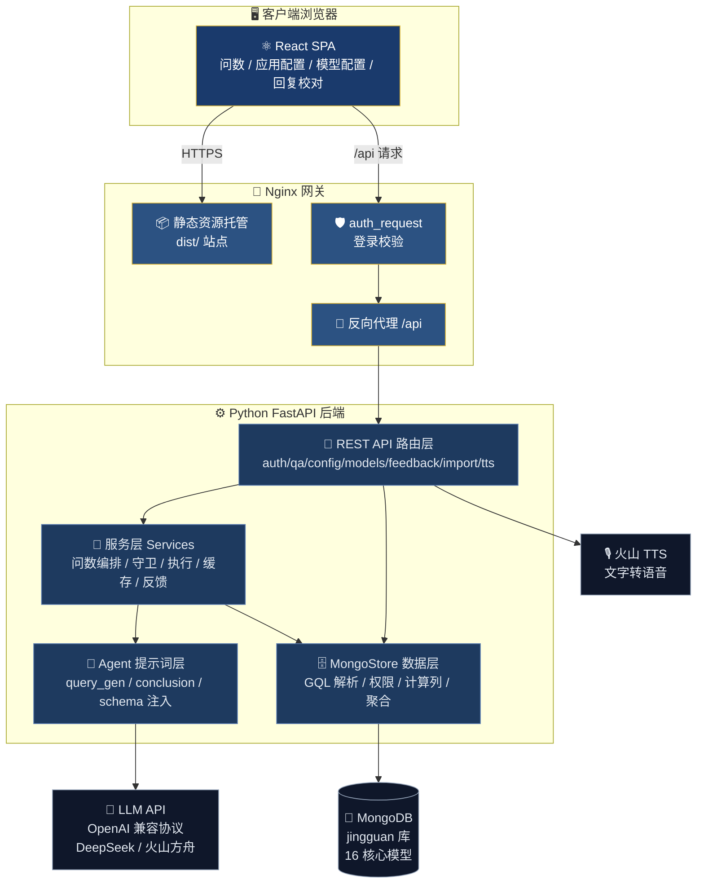

**关键设计**：前端不直接触碰 LLM 与数据库；所有跨域调用经 nginx 反向代理 + 登录鉴权后进入 FastAPI；LLM 产出由后端守卫把控，数据库仅经 MongoStore 数据层访问。

***

## 3. 技术栈总览

| 层        | 选型                            | 用途                         |
| -------- | ----------------------------- | -------------------------- |
| 前端框架     | React 19 + Vite + TypeScript  | SPA 页面与组件化                 |
| UI       | Tailwind CSS 4 + daisyUI 5    | 深蓝+金色品牌视觉                  |
| 状态       | Zustand（细粒度 store）            | 会话/配置/模型列表                 |
| 图表       | ECharts                       | 柱/条/饼/折线 4 类图              |
| 流式传输     | SSE（fetch ReadableStream）     | 问数结果逐块渲染                   |
| Web 后端   | Python 3.11 + FastAPI         | 分层 REST + 异步               |
| 数据层      | PyMongo（async）+ 自研 MongoStore | 纯 JSON schema 定义的数据访问      |
| 数据库      | MongoDB 7.0                   | 8 业务表 + 系统表                |
| 数据库校验    | Pydantic Settings             | .env 环境配置                  |
| Excel 解析 | openpyxl                      | 台账导入                       |
| LLM 客户端  | httpx（AsyncClient 复用连接池）      | OpenAI 兼容 chat/completions |
| 语音       | 火山引擎 TTS v3                   | AI 回复语音播报                  |
| 部署       | nginx + pm2 + uvicorn         | 单机演示部署                     |

***

## 4. 数据模型

### 4.1 全部模型（16 个）

业务模型（8 个，受问数守卫白名单管控）+ 系统模型（8 个）：

| 分类 | 模型名                | 集合（collection）     | 用途                  |
| -- | ------------------ | ------------------ | ------------------- |
| 台账 | `CommercialLedger` | commercial\_ledger | 商业签约台账（明细）          |
| 台账 | `PplLedger`        | ppl\_ledger        | 项目储备台账（阶段/风险）       |
| 台账 | `GoalLedger`       | goal\_ledger       | 经营目标台账（各单元年度目标）     |
| 报表 | `ReportOverall`    | report\_overall    | 整体达成（单元收入与拆分）       |
| 报表 | `ReportProduct`    | report\_product    | 产品线统计（收入与同比）        |
| 报表 | `ReportSolution`   | report\_solution   | 商解统计（收入与目标）         |
| 报表 | `ReportIndustry`   | report\_industry   | 行业统计（收入构成）          |
| 报表 | `ReportKeyUnit`    | report\_key\_unit  | 重点单元（订单/未收款/高风险）    |
| 系统 | `QaSession`        | qa\_session        | 会话                  |
| 系统 | `QaMessage`        | qa\_message        | 消息（含 AI 结构化 aiMeta） |
| 系统 | `AppConfig`        | app\_config        | 应用配置（KV）            |
| 系统 | `AiModel`          | ai\_model          | LLM 模型配置            |
| 系统 | `Feedback`         | feedback           | 用户手动反馈（回复校对）        |
| 系统 | `ImportLog`        | import\_log        | 台账导入记录              |
| 系统 | `QueryExample`     | query\_example     | 问法缓存（自学习）           |
| 系统 | `AutoFeedback`     | auto\_feedback     | 自动反馈（纵深防御告警）        |

### 4.2 业务表 ER 图

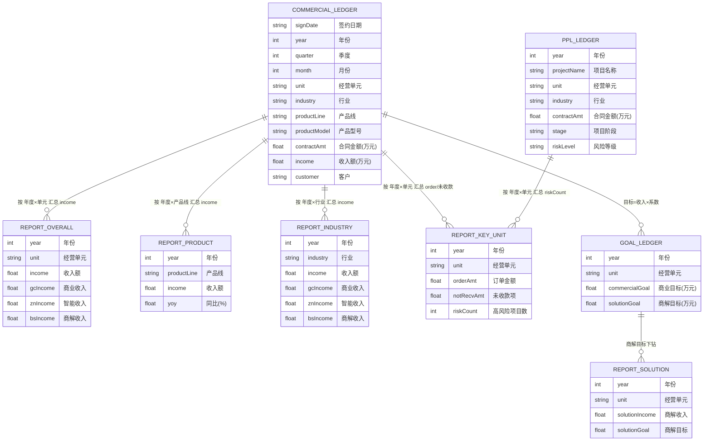

### 4.3 维度枚举（取自原型，保证演示一致性）

| 维度               | 枚举值                                                                           |
| ---------------- | ----------------------------------------------------------------------------- |
| 经营单元（unit）       | 北京/上海/深圳/广州/成都/杭州/南京/武汉/西安/沈阳代表处 + 政企/金融/能源/交通/教育/医疗/互联网/制造/运营商/解决方案/创新业务 事业部 |
| 行业（industry）     | 政企、金融、能源、交通、教育、医疗、互联网、制造、运营商                                                  |
| 产品线（productLine） | 智能计算、智能存储、智能网络、智能安全、AI大模型                                                     |
| 产品型号             | 各产品线下 2\~3 个型号（如 JS-9100 / CC-E500 / AI-Max）                                  |
| 项目阶段（stage）      | 线索、商机、方案、商务、签约                                                                |
| 风险等级（riskLevel）  | 高、中、低                                                                         |
| 年度（year）         | 2025、2026                                                                     |

**数据自洽性**：明细汇总值 ≈ 统计表值；完成率 = income/goal；占比合计 = 100%；同比 = (今年-去年)/去年。种子数据由 `generate_data.py` 用 `random.seed(42)` 固定生成，可重复重建。

***

## 5. 核心链路：text-to-query 问数引擎

### 5.1 端到端时序图

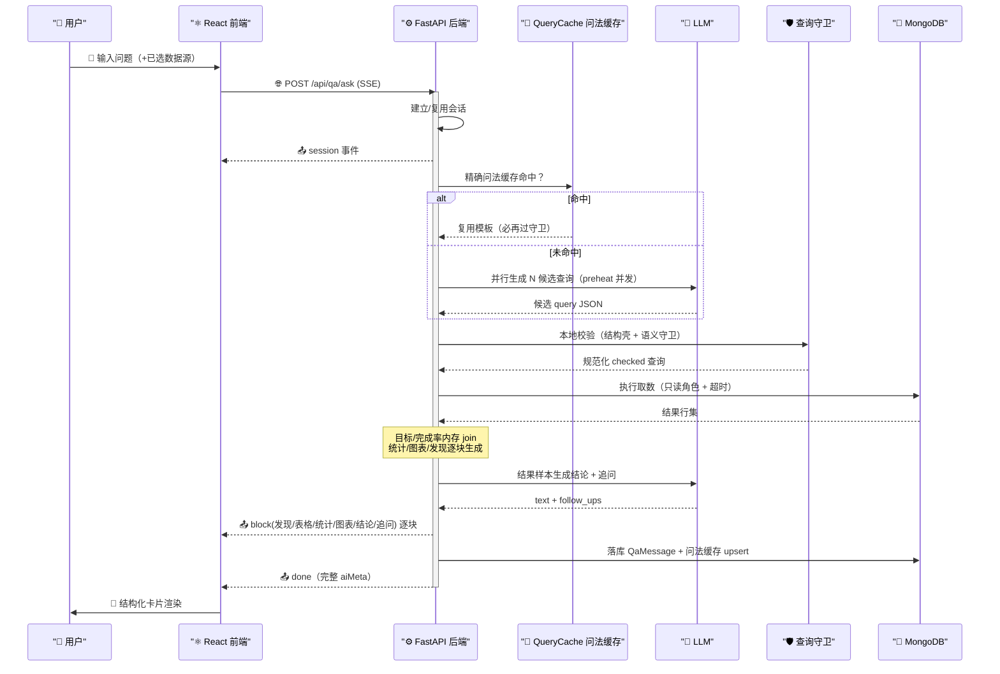

### 5.2 问数编排流程图（5 步分析过程）

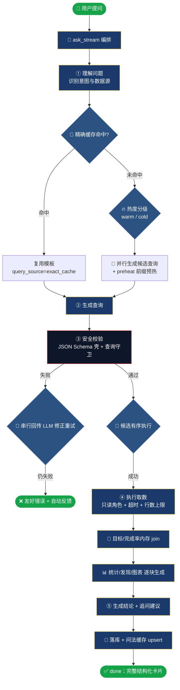

**5 步定义**（[step\_tracker.py](file:///f:/独立开发者/项目/AI创新中心项目/server/app/agent/step_tracker.py)）：

| 步 | 名称   | 中间产物                        |
| - | ---- | --------------------------- |
| 0 | 理解问题 | 识别意图、确定目标模型与数据源分组           |
| 1 | 生成查询 | 并行 N 候选 / 复用缓存模板            |
| 2 | 安全校验 | 结构壳校验 + 语义守卫，规范化 checked 查询 |
| 3 | 执行取数 | 只读执行返回行集（含目标/完成率 join）      |
| 4 | 生成结论 | 结论文本 + 3 条追问建议              |

### 5.3 查询候选生成（阶段二）与热度分级（阶段三）

| 分级    | 触发条件         | 候选数 | 并发 | 说明                      |
| ----- | ------------ | --- | -- | ----------------------- |
| exact | 精确问法缓存命中     | 0   | 0  | 直接复用模板执行，省一次 query\_gen |
| warm  | 模糊相似度 ≥ 0.75 | 1   | 1  | 有近例可依，一次生成大概率过守卫        |
| cold  | 无/弱缓存参考      | 3   | 2  | 候选兜底，并发温和，防限流           |

- **并发生成**：`query_candidate.generate_candidates` 用 `asyncio.gather` 并行生成 N 候选，候选 0 携带 few-shot、其余不携带提升多样性；`preheat` 预热用空问题渲染恒定 system 前缀，先写入 LLM 缓存摊薄成本。

- **择优执行**：`pick_checked` 对所有候选就地做守卫校验，按序取首个通过者执行，多出的候选作执行失败备选，无需再调 LLM。

### 5.4 结构化卡片协议

SSE 事件序列（[qa.py 路由](file:///f:/独立开发者/项目/AI创新中心项目/server/app/routers/qa.py) / [qa\_service.py](file:///f:/独立开发者/项目/AI创新中心项目/server/app/services/qa_service.py)）：

| 事件        | 载荷                                          | 作用                        |
| --------- | ------------------------------------------- | ------------------------- |
| `session` | session\_id                                 | 会话就绪，前端挂载消息流              |
| `steps`   | 5 步清单                                       | 建立步骤骨架                    |
| `step`    | index/status/desc                           | 单步 running/done/fail 逐步点亮 |
| `block`   | findings/table/stats/chart/text/follow\_ups | 结果块逐块推送                   |
| `done`    | 完整 QaAskResp                                | 与落库 aiMeta 一致             |
| `error`   | message                                     | 异常统一转结构化错误                |

前端 [useQaChat.ts](file:///f:/独立开发者/项目/AI创新中心项目/web-front/src/hooks/useQaChat.ts) 逐事件 patch 当前 AI 消息，[AiCard](file:///f:/独立开发者/项目/AI创新中心项目/web-front/src/features/qa/AiCard/index.tsx) 按块渲染（分析过程 → 数据发现 → 表格 → 统计 → 图表 → 结论 → 追问）。

***

## 6. 安全体系（纵深防御）

### 6.1 三层防护架构

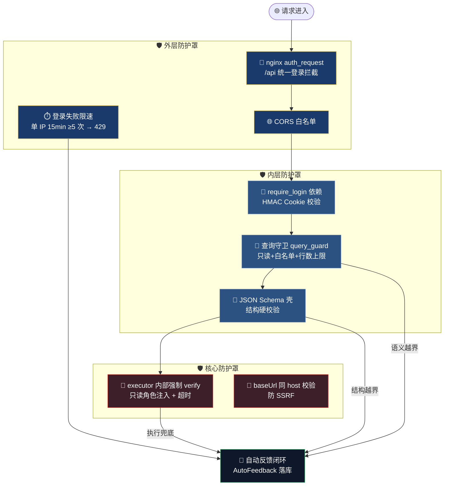

### 6.2 查询守卫（核心语义校验）

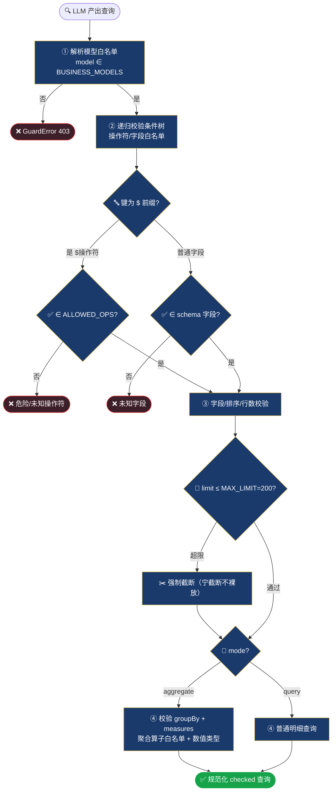

**守卫白名单**（[query\_policy.py](file:///f:/独立开发者/项目/AI创新中心项目/server/app/config/query_policy.py)）：

| 类别    | 白名单/策略                                                                      |
| ----- | --------------------------------------------------------------------------- |
| 模型    | 仅 `BUSINESS_MODELS` 8 个业务表                                                  |
| 条件操作符 | `$eq $gt $gte $lt $lte $in $nin $ne $exists`（默认拒绝）                          |
| 禁止操作符 | `$where $lookup $unionWith $merge $out $expr $function $regex $and $or ...` |
| 聚合算子  | `sum avg count min max`                                                     |
| 行数上限  | `MAX_LIMIT = 200`（超限截断）                                                     |
| 执行超时  | `EXEC_TIMEOUT = 10s`                                                        |

### 6.3 自动反馈（堡垒思想 · 告警优先）

**原则**：允许被拦截，禁止静默失守。任何兜底/越界/防护拦截一旦触发，立即写入一条 `AutoFeedback`，写明触发原因、命中哪层防护、上游病灶、修复指引，供 AI（或人）直接探查修复。

| 触发类别     | 触发点                           | 说明                       |
| -------- | ----------------------------- | ------------------------ |
| guard    | cache\_exact\_hit\_guard      | 缓存模板被守卫拦下（缓存与 schema 脱节） |
| shell    | query\_gen\_shell\_validation | LLM 产出结构越界（未达语义守卫层）      |
| fallback | 降级/兜底路径                       | 主路径失效走兜底                 |

反馈记录走 `run_as_internal`（全程 internal 权限），`record` 内部自吞异常，告警本身不击穿调用方。

***

## 7. 前端架构

### 7.1 组件结构与路由

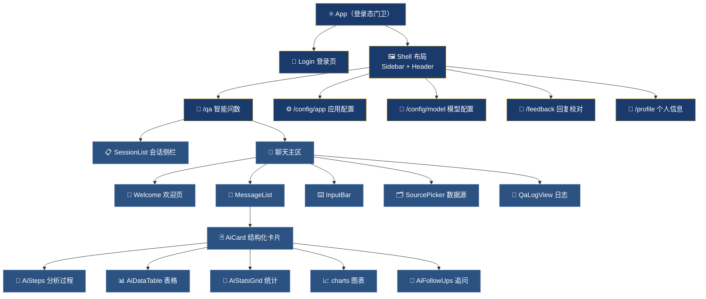

### 7.2 状态管理与数据流

| Store/Hook            | 职责                                           |
| --------------------- | -------------------------------------------- |
| `useSessionStore`     | 会话列表（createListStore + 防重锁）                  |
| `useConfigStore`      | 应用配置（greeting/tts/stt/hotRecommend）          |
| `useModelStore`       | 模型列表                                         |
| `useQaChat`           | 问数流：messages/activeId/sending + SSE 逐块 patch |
| `useSnackbar`         | 全局提示                                         |
| API 层 `api/modules/*` | 封装 REST/SSE，Cookie 认证 + 401 拦截               |

**认证数据流**：首屏 `authApi.check()` 校验后端签名 Cookie，通过进入 Shell；任意接口 401 触发 `auth:expired` 自定义事件，全局跳登录。

***

## 8. 后端架构

### 8.1 分层结构

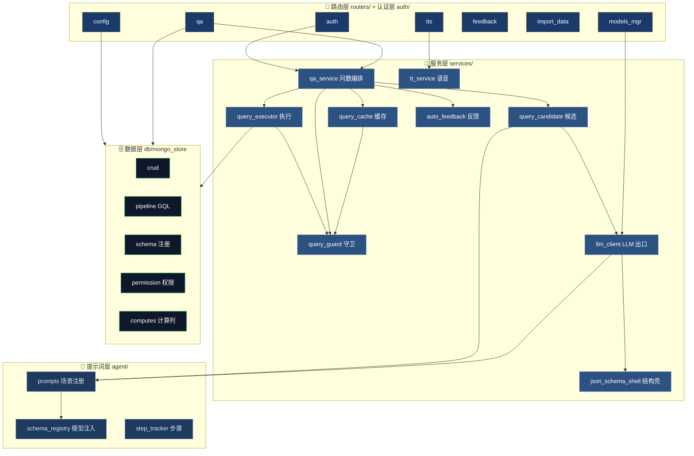

### 8.2 MongoStore 数据层（核心机制）


**核心理念**（[mongo\_store/__init__.py](file:///f:/独立开发者/项目/AI创新中心项目/server/app/db/mongo_store/__init__.py)）：

| 特性               | 说明                               |
| ---------------- | -------------------------------- |
| 纯 JSON schema 定义 | 零代码定义模型，schema 唯一事实源             |
| 读取补默认值 + 计算列     | 写入只存用户数据，读取时补默认值                 |
| GQL 树形查询         | 一次 $lookup 聚合完成关联                |
| 权限引擎             | ContextVar 上下文 + 角色评估 + 字段过滤     |
| 自动归档             | 删除先归档 `_deleted` 附表              |
| 两阶段优化            | $lookup + 分页时先取 ID 再关联，避免全量 join |

**权限角色**（[permission.py](file:///f:/独立开发者/项目/AI创新中心项目/server/app/db/mongo_store/permission.py)）：`super_admin/admin/internal` 自动放行；`creator` 由 `createdBy === userId` 动态判断；`guest` 默认禁止。业务表 `_BIZ_RW = read[internal,query] / write[internal]`，即 AI 查询仅经 `query` 只读角色触达，管理写入仅 `internal`。

### 8.3 LLM 集成（唯一出口）

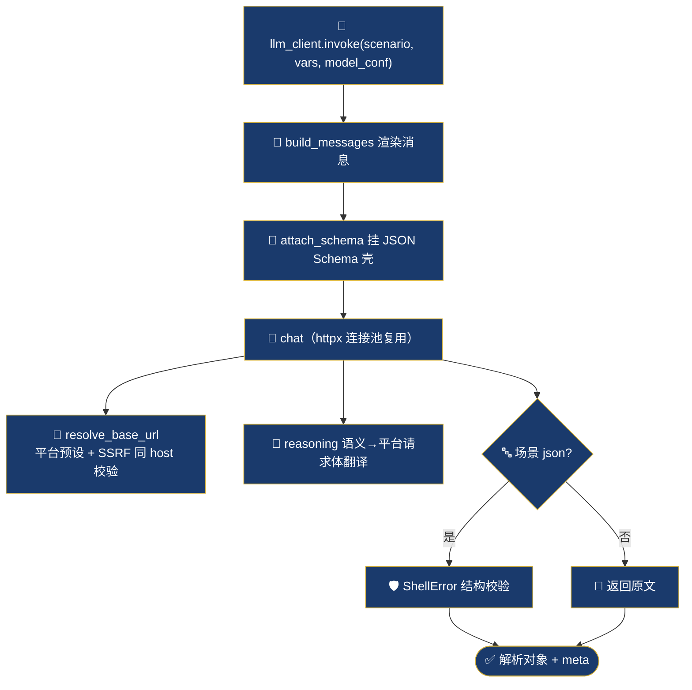

**三层配置**：平台层（`PLATFORM_PRESETS`：deepseek/volcengine）→ 模型层（`AiModel` 记录）→ 场景层（`agent/prompts`：query\_gen/conclusion）。JSON Schema 壳在唯一 LLM 出口浅层挂载：入口注入恒定 system，出口结构硬校验，失败抛 `ShellError`（结构层）——与 query\_guard（语义层）分层。

***

## 9. 认证与会话机制

### 9.1 登录链路

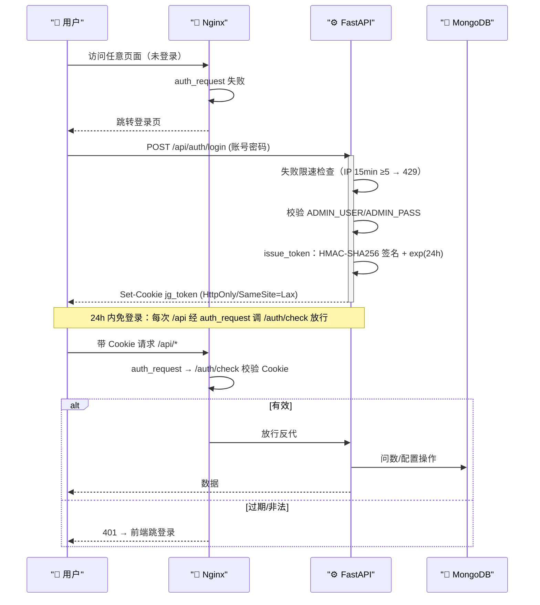

**认证要点**：

| 项         | 实现                                                   |
| --------- | ---------------------------------------------------- |
| 签名算法      | HMAC-SHA256（`APP_SECRET_KEY`），`base64(payload).sig`  |
| 时效        | `TOKEN_TTL = 86400`（24h）                             |
| Cookie 属性 | HttpOnly + SameSite=Lax + Secure(HTTPS 后)            |
| 双层防护      | nginx `auth_request` + FastAPI `require_login`（互为冗余） |
| 登录限速      | 单 IP 15 分钟窗口 ≥5 次失败 → 429                            |

***

## 10. 质量保障与评测

### 10.1 评测体系（text-to-query）

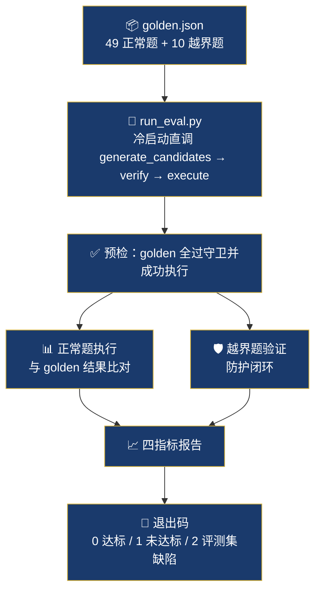

**四指标已全部达标**（[评测报告](file:///f:/独立开发者/项目/AI创新中心项目/doc/test-report/2026/09/text-to-query评测报告-20260905.md)）：

| 指标          | 结果     | 门槛    | 判定   |
| ----------- | ------ | ----- | ---- |
| 守卫通过率       | 100.0% | ≥90%  | PASS |
| 模型选对率       | 97.96% | ≥85%  | PASS |
| 结果正确率（一票否决） | 97.96% | ≥80%  | PASS |
| 越界安全率       | 100.0% | =100% | PASS |

**评测要点**：

- **execution-based 比对**：与 golden 查询执行结果做多重集比对（非字符串匹配），容忍聚合列名别名（`sum_income ↔ income`）、排序/tie 次序、limit 超出题意的截断。

- **越界安全**：越界题未发生「危险查询被执行」为结构性保证（executor 内部强制 verify，双重封死）。

- **自动反馈闭环**：守卫拦截 LLM 细节完整落入报告，作为自动反馈载体，不落库不静默。

### 10.2 测试与自检

| 层    | 手段                                                         |
| ---- | ---------------------------------------------------------- |
| 后端单元 | `server/tests/test_unit.py` + py\_compile + 模块加载           |
| 变异测试 | `server/mutants/`（mutmut）                                  |
| 前端单元 | `*.test.ts`（client/chart/date/error/localStorage/markdown） |
| 前端自检 | `doc/test-report/.../web-front极致自检报告.md`                   |
| 端到端  | 云端 curl + 自然语言问数链路验证                                       |

> 服务端测试遵循 testing-rules：**常驻/演示实例只在服务器 <user> 账号运行（pm2）**，本地仅静态自检，完整链路验证走云端。

***

## 11. 部署架构

```mermaid
graph LR
    subgraph Server["🖥️ 服务器 <user>@<SERVER_IP>"]
        NG["🌐 Nginx<br/>静态 + 反代 + auth_request"]
        PM2["⚙️ pm2 → uvicorn<br/>jingguan-api (127.0.0.1:8000)"]
        MONGO[("🍃 MongoDB 7.0<br/>127.0.0.1:27018<br/>认证启用")]
        WEB["📦 web-front/dist"]
    end

    LLM["🤖 LLM API<br/>DeepSeek / 火山方舟"]
    TTS["🎙️ 火山 TTS"]

    NG --> WEB
    NG -->|/api 反代| PM2
    PM2 --> MONGO
    PM2 -->|凭据走服务器 .env| LLM
    PM2 --> TTS

    classDef n fill:#1a3a6c,stroke:#d4af37,color:#fff;
    class NG,PM2,WEB n;
    class MONGO fill:#0f172a,stroke:#16a34a,color:#fff;
    class LLM,TTS fill:#0f172a,stroke:#94a3b8,color:#e2e8f0;
```

**部署要点**：

| 项       | 说明                                                                                         |
| ------- | ------------------------------------------------------------------------------------------ |
| 后端进程    | pm2 管理 `jingguan-api`，`uvicorn app.main:app --host 127.0.0.1 --port 8000`                  |
| 前端托管    | `npm run build` 产物 `dist/` 由 nginx root 指向                                                 |
| MongoDB | systemd 服务 `mongod-jingguan`，回环 + 认证，端口 27018                                              |
| 机密      | `.env` 只存服务器侧，`chmod 600`，不入 git                                                           |
| 启动流程    | lifespan：`validate_security`（安全基线 fail-fast）→ `register_all` → `connect` → `seed_if_empty` |

**安全基线 fail-fast**（[settings.py](file:///f:/独立开发者/项目/AI创新中心项目/server/app/config/settings.py)）：`APP_SECRET_KEY` / `ADMIN_PASS` 缺失或仍为历史泄露默认值时拒绝启动，强制轮换。

***

## 12. 目录结构

```
AI创新中心项目/
├── server/                      # Python FastAPI 后端
│   ├── app/
│   │   ├── main.py              # 组装：CORS/路由/异常处理/启动事件
│   │   ├── config/              # 配置中心（settings/qa/query_policy/auth/...）
│   │   ├── routers/             # 路由层（qa/config/models_mgr/feedback/import/tts）
│   │   ├── services/            # 服务层（qa_service/query_guard/query_executor/...）
│   │   ├── agent/               # 提示词层（prompts/schema_registry/step_tracker）
│   │   ├── models/              # 模型注册 + schema 定义（16 模型）
│   │   ├── db/mongo_store/      # 数据层（crud/pipeline/schema/permission/computes）
│   │   ├── auth/                # HMAC Cookie 认证
│   │   └── seed/                # 维度常量 + 固定种子灌库
│   ├── eval/                    # 离线评测（golden.json + run_eval.py）
│   ├── tests/                   # 后端单元测试
│   ├── mutants/                 # 变异测试（mutmut）
│   └── requirements.txt
├── web-front/                   # React 19 前端
│   └── src/
│       ├── pages/               # 页面（Qa/config/Feedback/Login/Profile）
│       ├── features/qa/         # 问数功能组件（AiCard/SessionList/InputBar/...）
│       ├── components/          # 通用组件（Layout/Pagination/Snackbar/...）
│       ├── hooks/               # useQaChat/useSnackbar/usePagedList/...
│       ├── store/               # Zustand store（session/config/model）
│       ├── services/            # chart/clipboard/download/favorites/...
│       ├── api/                 # 客户端 + 模块化 API 封装
│       └── utils/               # date/error/localStorage/markdown
└── doc/                         # 文档（solution/execution/test-case/test-report）
```

***

## 13. 边界与约束

**明确不做**（范围红线）：

- 业务级登录/注册/用户管理/角色权限（任务书明确不做，仅 nginx 简单登录）

- 移动端适配（桌面 Chromium 为目标）

- 真实企业数据对接（全部自制数据）

- 多租户、审计日志等生产级安全体系

- 原型中无导航入口的驾驶舱/报表页（其数据以"统计报表"数据源形式支持问数）

**非功能指标**：

| 项      | 指标                                 |
| ------ | ---------------------------------- |
| 问数响应   | 常规问题端到端 ≤ 10s（含 LLM 两段调用）          |
| SQL 执行 | 单次 ≤ 2s，超时 10s 中止并走重试              |
| 表格容量   | 单次最多 200 行，超出提示截断                  |
| 登录时效   | Cookie 24h，过期自动跳登录                 |
| 安全     | AI 查询仅只读 + 白名单 + 行数上限；密钥不入前端不入 git |

## 禁止事项

❌ 常驻/演示实例不在本地启动（仅服务器 <user> 账号）\
❌ `.env` 机密（密钥/连接串/API Key）不提交入库或写示例文件\
❌ LLM 产出查询不裸执行（必过守卫 + executor 强制 verify）\
❌ AI 查询不触达系统表（仅 8 业务模型白名单）\
❌ 防护拦截不静默（必落 AutoFeedback 自动反馈）

## 注意事项

1. **text-to-query 语义**：本文档及全项目中的"查询"均指对 mongo-store 模型的结构化查询，非 SQL 文本
2. **安全是底线**：纵深防御三层防护，任何被拦截都触发自动反馈供回溯加固
3. **部署仅云端**：完整验证走 `<user>@<SERVER_IP>`（pm2 + curl），本地只做静态自检
4. **数据自洽**：8 张业务表由固定种子生成，明细汇总 ≈ 统计表值，完成率 = 收入/目标
5. **唯一事实源**：schema 定义在 `models/schema/`，提示词在 `agent/prompts/`，改为一处全链路生效

